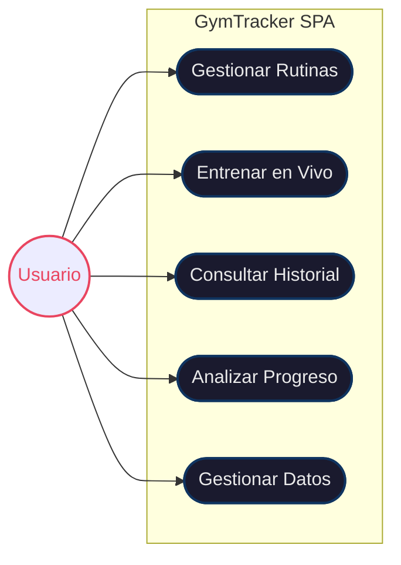
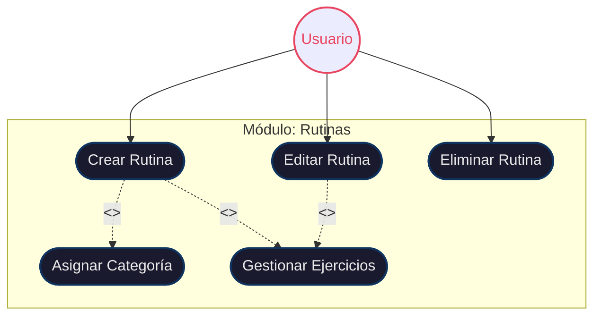
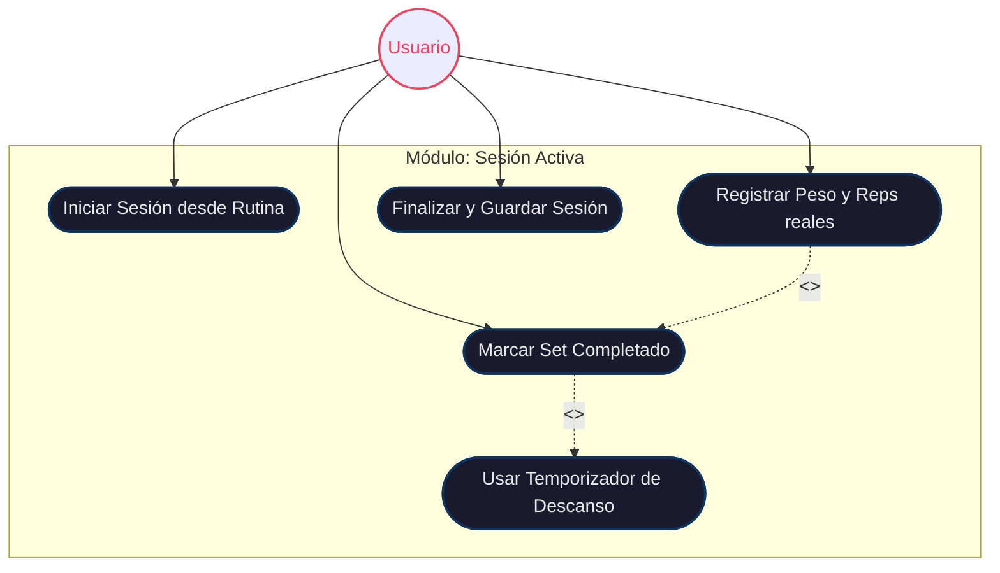
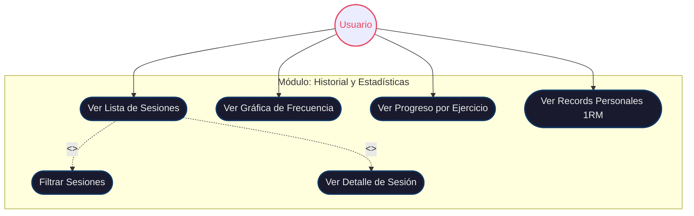

# 📐 Diagramas de Casos de Uso (UML) — GymTracker SPA

Este documento contiene los diagramas de casos de uso del sistema. Debido a que la aplicación es de uso personal y local (SPA sin backend), existe un único actor: el **Usuario**.

## 1. Diagrama General de Casos de Uso

---

## 2. Gestión de Rutinas (Desglose)

---

## 3. Sesión de Entrenamiento en Vivo (Desglose)

---

## 4. Consulta y Análisis (Desglose)

